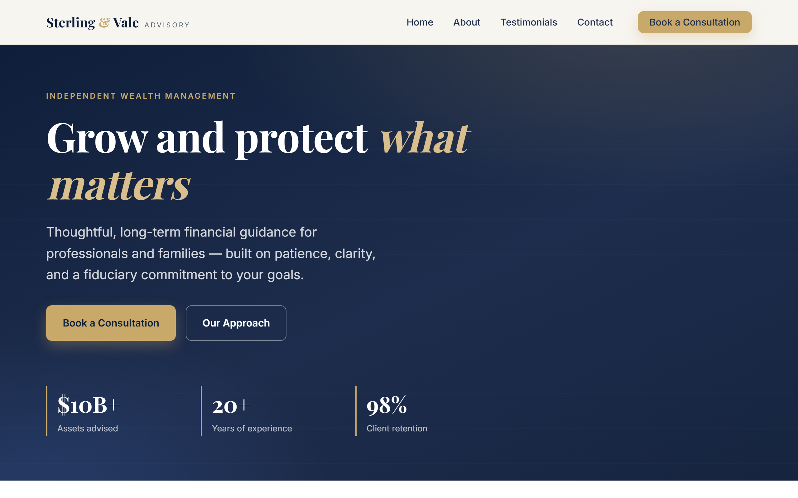

# Sterling & Vale Advisory

A single-page **lead-magnet** website for **Sterling & Vale Advisory**, a fictional independent wealth-management firm. The page offers a free, personalized *"Wealth Blueprint"* in exchange for an enquiry, wrapped in a purple/aubergine premium identity. The entire site is one self-contained file — [index.html](index.html) — containing the HTML, an embedded `<style>` block, and an embedded `<script>` block.

🔗 **Live site:** https://darrenrulz1609.github.io/Darren-Tan/



## Features

- **Fully self-contained** — no build step, no package manager, no dependencies (only Google Fonts via `<link>`).
- **Responsive** layout tuned for ~375 / 768 / 1280px breakpoints; the nav collapses to a hamburger ≤860px.
- **Scroll-reveal animations** via `IntersectionObserver` (respects `prefers-reduced-motion`), plus a scroll-progress bar, floating hero orbs, and animated count-up on the hero stats.
- **"How it works"** 3-step section and an accessible **FAQ accordion** (mirrored by `FAQPage` structured data).
- **Testimonial carousel** — a static 3-column grid ≥1024px, and a JS one-at-a-time carousel (auto-rotate + prev/next/dots) below that.
- **Lead-magnet enquiry form** with client-side validation, a honeypot anti-spam field, a lead-qualifying field, and AJAX submission via [FormSubmit](https://formsubmit.co) — no page redirect.
- **SEO-ready** — canonical tag, Open Graph + Twitter cards, `FinancialService` JSON-LD structured data, plus [robots.txt](robots.txt) and [sitemap.xml](sitemap.xml).

## Tech stack

Vanilla HTML, CSS, and JavaScript — by design. No frameworks, bundlers, or external JS/CSS libraries.

## Running locally

Open the file directly in a browser (`file://`), or serve the folder:

```bash
python -m http.server
# then visit http://localhost:8000
```

There is nothing to build, lint, or test via tooling — "testing" means opening the page and exercising it manually (responsiveness, scroll animations, the carousel, and the form's validation/sending/success/error states).

## Project structure

```
.
├── index.html                  # The entire site (HTML + CSS + JS)
├── robots.txt                  # Crawler directives + sitemap reference
├── sitemap.xml                 # XML sitemap
├── .github/workflows/deploy.yml # GitHub Actions → GitHub Pages deployment
├── CLAUDE.md                   # Guidance for working in this repo
└── README.md
```

The `<style>` block is organized top-down: design tokens → base/reset → component sections → reveal animation → responsive `@media` blocks. All colours and spacing come from `:root` custom properties (`--plum-*`, `--orchid`, `--champagne`, `--space-*`, etc.) — change tokens there rather than hardcoding values.

The `<script>` block is a series of self-invoking IIFEs, one per concern (mobile nav, smooth-scroll, scroll reveal, carousel, footer year, enquiry form), each guarded against missing elements.

## Deployment

Every push to `main` triggers the [GitHub Actions workflow](.github/workflows/deploy.yml), which publishes the site to GitHub Pages.

## Enquiry form

The form submits via FormSubmit's AJAX endpoint using `fetch()`. The destination address is the `ENDPOINT` constant inside the form IIFE in [index.html](index.html).

> **Activation note:** FormSubmit sends a one-time confirmation email on the first submission to any new address; the form delivers nothing until that link is clicked.
